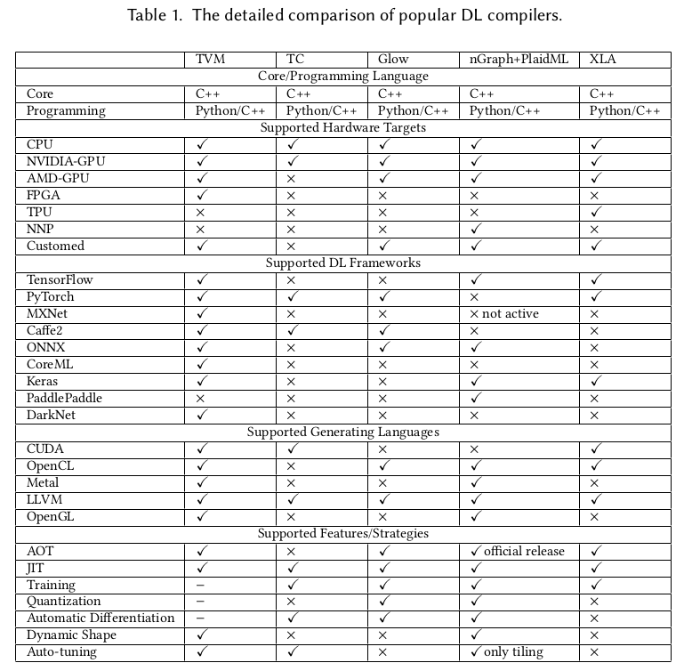

.. _sec-dlcompiler:

Deep learning compiler
======================

.. contents::
   :local:
   :depth: 4

Deep learning compiler reference
---------------------------------

The current open source compilers for deep learning [#dlcs]_ as follows,

.. _dlcs-f: 

TVM compiler open source infrastructure supports most of DL Frameworks such as 
TensorFlow, PyTorch..., and generating CUDA/OpenCL/OpenGL for gpu and LLVM for 
cpu.

The NVIDIA CUDA Toolkit provides a development environment for creating 
high-performance GPU-accelerated applications. 
GPU-accelerated CUDA libraries enable acceleration across multiple domains such 
as linear algebra, image and video processing, deep learning and graph 
analytics [#gpu4dl]_.

OpenCL runs on AMD GPUs and provides partial support for TensorFlow and PyTorch. 
If you want to develop new networks some details might be missing, which could 
prevent you from implementing the features you need [#gpu4dl]_.
For instance, if ARM GPU doesn't implement operation "Cosh" on TVM while a DL model
created from PyTorch generate "Cosh" operation, then it will fail to run
the DL model though TVM compile PyTorch model into OpenCL.

.. [#dlcs] https://arxiv.org/pdf/2002.03794.pdf

.. [#gpu4dl] https://missinglink.ai/guides/tensorflow/tensorflow-support-opencl/
