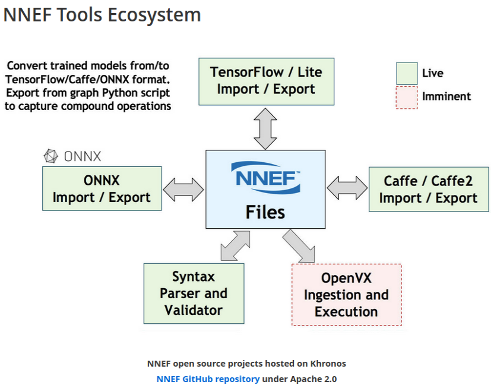

.. _sec-dlcompiler:

Deep learning compiler
======================

.. contents::
   :local:
   :depth: 4

Survey
------

The current open source compilers for deep learning [#dlcs]_ as follows,

.. _dlcs-f: 
.. figure:: ../Fig/dlcompiler/dlcompilersurvey.png
  :align: center
  :scale: 100%

TVM compiler open source infrastructure supports most of DL Frameworks such as 
TensorFlow, PyTorch..., and generating CUDA/OpenCL/OpenGL for gpu and LLVM for 
cpu.

GPU
---

The NVIDIA CUDA Toolkit provides a development environment for creating 
high-performance GPU-accelerated applications. 
GPU-accelerated CUDA libraries enable acceleration across multiple domains such 
as linear algebra, image and video processing, deep learning and graph 
analytics [#gpu4dl]_.

OpenCL runs on AMD GPUs and provides partial support for TensorFlow and PyTorch. 
If you want to develop new networks some details might be missing, which could 
prevent you from implementing the features you need [#gpu4dl]_.
For instance, if ARM GPU doesn't implement operation "Cosh" on TVM while a DL model
created from PyTorch generate "Cosh" operation, then it will fail to run
the DL model though TVM compile PyTorch model into OpenCL.
Once "Cosh" is implemented with kernel fuction "Cosh" in OpenCL by calling
GPU's instructions, it can be fixed.

NNEF
-----

Neural Network Exchange Format.

NPU or GPU can apply NNEF to supprt all AI models.

The goal of NNEF is to enable data scientists and engineers to easily transfer 
trained networks from their chosen training framework into a wide variety of 
inference engines. A stable, flexible and extensible standard that equipment 
manufacturers can rely on is critical for the widespread deployment of neural 
networks onto edge devices, and so NNEF encapsulates a complete description of 
the structure, operations and parameters of a trained neural network, 
independent of the training tools used to produce it and the inference engine 
used to execute it [#nnef]_.

ONNX and NNEF are Complementary
ONNX moves quickly to track authoring framework updates
NNEF provides a stable bridge from training into edge inferencing engines 
[#nnef]_.

.. _nnefeco-f: 

ONNX import/export to NNEF, should edge NPU use NNEF [#nnef]_?

OpenVX
------

OpenVX enables the graph to be extended to include hardware architectures 
that don’t support programmable APIs [#openvx]_.

It is designed by the Khronos Group to facilitate portable, optimized and 
power-efficient processing of methods for vision algorithms [#openvx-wiki]_. 
Nothing about NPU I think.

SYCL
~~~~

User use SYCL or DSL compile domain language into SYCL and run on OpenCL 
hardwares [#sycl]_. An example here [#sycl-wiki]_.

.. _syclcompiler-f: 
.. figure:: ../Fig/dlcompiler/syclcompiler.png
  :align: center
  :scale: 100%

.. _syclimp-f: 
.. figure:: ../Fig/dlcompiler/syclimp.png
  :align: center
  :scale: 100%

Tools
-----

Create onnx test file [#onnx-editor]_.

.. [#dlcs] https://arxiv.org/pdf/2002.03794.pdf

.. [#gpu4dl] https://missinglink.ai/guides/tensorflow/tensorflow-support-opencl/

.. [#nnef] https://www.khronos.org/nnef

.. [#openvx] https://www.khronos.org/openvx

.. [#openvx-wiki] https://en.wikipedia.org/wiki/OpenVX

.. [#sycl] https://www.khronos.org/sycl

.. [#sycl-wiki] https://en.wikipedia.org/wiki/SYCL

.. [#onnx-editor] https://www.youtube.com/watch?v=QZQwmZTfLmI

