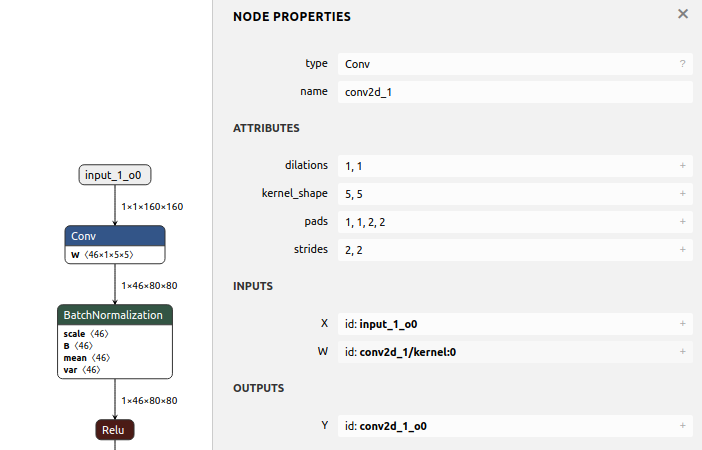

.. _sec-npu:

NPU compiler
============

.. contents::
   :local:
   :depth: 4

Abstract
--------

Tensorflow support unknown shape [#tfunknownshape]_.
Though our npu support kernel call where kernel call is a set of 
commands to npu to deal shape at run time, it is unefficiency. 
As I remember mlit supports binding shape for unknown at compile-time
but not always work.
Lukily, we can customilze by redefining model to binding shape staticlly [20200412].  

MLIR and IREE
-------------
IREE (Intermediate Representation Execution Environment, pronounced as "eerie") 
is an MLIR-based end-to-end compiler that lowers ML models to a unified IR 
optimized for real-time mobile/edge inference against heterogeneous hardware 
accelerators. IREE also provides flexible deployment solutions for the compiled 
ML models [#iree]_ as the following figure.

.. _iree-f: 
.. figure:: ../Fig/npu/IREE-Architecture.png
  :align: center
  :scale: 100%

- HAL IR: Vulkan-like allocation and execution model encoding -> on-line first-time compilation and save in cache. Executable compilation via architecture specific backend compiler plugins.

- VM IR: Dynamic module linkage definitions (imports, exports, globals, etc) [#vm-ir-dml]_.

The purpose of mlir is:

- Connect cpu with mlir-to-llvm-ir.

The purpose of iree is:

- Connect gpu with iree-to-spirv.

Both purpose of mlir and iree is:

- Reduce bug and problem between heterogeneous hardware accelerators [#mlir-iree-purpose]_. 

Tensorflow
----------

The mechansim of Mlir and iree applied on tensorflow as the figure above section 
is not fitted for off-line edge npu that stand alone without server-connection 
for tunning weight of face detection's purpose. 
It is designed for on-line server-connected npu.
The gpu of supporting spirv is best candidate until this date 2020/5/12.

At beginning, tensorflow rely on api without fixed format such as ONNX [#onnx-fmt]_. 
As a result ONNX emerged and adopted for most of npu in their private backend 
compiler. Google does not like to hire onnx as the format for npu backend compiler
onnx-mlir project [#onnx-mlir]_ which convert onnx to mlir dialect is sponsored
by Google I guess [#onnx-mlir-sponsor]_ for encourging new npu compiler 
development hiring mlir as their compiler input (convert onnx to mlir then 
handling mlir input).

With mlir and iree appear on tensorflow as a series of fixed formats in
tensorflow as section above. The hardware vendors for cloud server AI machine 
with heterogeneous hardware accelerators will run tensorflow system 
by supporting mlir/iree input format in their compilers more and more.
So, it is unavoidable that tensorflow system's npu vendors have to support
mlir/iree input format beyond onnx. Or open source software or vendor software 
appear to do transfer from mlir/iree to onnx. (python in tensorflow api allow 
unknown type and shape size, so it cannot transer python api to onnx fully).

If lucky, google may hire onnx. Because onnx format is older than mlir
in history. In addition in aspect of format, mlir has mult-level mult-dialect and 
more complicate while onnx is easy and better to understand (P.S. I don't dig 
into mlir yet). 
Many AI models has supported onnx file format. For some AI model's formats that
run on tensorflow without supporting onnx, aplly tensorflow-onnx open 
source project [#tf-onnx]_ can convert tensorflow to onnx partly.

Onnx alliance may release some programs for transfering mlir to onnx for fighting
agiant mlir-iree growing in npu compiler but not at this moment.

For off-line edge npu that stand alone without server-connection
for tunning weight of face detection's purpose, supprting mlir-iree compiler
may not necessary.

mlir to onnx
------------

https://www.tensorflow.org/mlir

https://mlir.llvm.org/talks/

https://llvm.org/devmtg/2019-04/talks.html#Tutorial_1

- 3 ppt in llvm tutorials

https://llvm.org/devmtg/2019-04/slides/Tutorial-AminiVasilacheZinenko-MLIR.pdf

build mlir: https://mlir.llvm.org/getting_started/

.. code-block:: console

  ~/llvm/1/llvm-project/build$ cmake -G Ninja ../llvm \
  >    -DLLVM_ENABLE_PROJECTS=mlir \
  >    -DLLVM_BUILD_EXAMPLES=ON \
  >    -DLLVM_TARGETS_TO_BUILD="X86;NVPTX;AMDGPU" \
  >    -DCMAKE_BUILD_TYPE=Release \
  >    -DLLVM_ENABLE_ASSERTIONS=ON

  ~/llvm/1/llvm-project/build$ cmake --build . --target check-mlir
  [200/1919] Generating VCSRevision.h
  -- Found Git: /usr/bin/git (found version "2.17.1") 
  [1604/1919] Building CXX object tools/mlir/tools/mlir-linalg-ods-gen/CMakeFiles/mlir-linalg-ods-gen.dir/mlir-linalg-ods-gen.cpp.o
  /home/cschen/llvm/1/llvm-project/mlir/tools/mlir-linalg-ods-gen/mlir-linalg-ods-gen.cpp:935:6: warning: ‘bool {anonymous}::Expression::operator==(const {anonymous}::Expression&) const’ defined but not used [-Wunused-function]
   bool Expression::operator==(const Expression &e) const {
        ^~~~~~~~~~
  [1918/1919] Running the MLIR regression tests

  Testing Time: 9.88s
    Unsupported Tests:  16
    Expected Passes  : 465

run: https://mlir.llvm.org/docs/Tutorials/Toy/

.. code-block:: console

  ~/llvm/1/llvm-project/mlir/test/Examples/Toy/Ch1$ ~/llvm/1/llvm-project/build/bin/toyc-ch1 ast.toy -emit=ast
  ...
  ~/llvm/1/llvm-project/mlir/test/Examples/Toy/Ch1$ ~/llvm/1/llvm-project/build/bin/toyc-ch1 ast.toy -emit=ast 2>&1 | ~/llvm/1/llvm-project/build/bin/FileCheck ast.toy
  ~/llvm/1/llvm-project/mlir/test/Examples/Toy/Ch1$ ~/llvm/1/llvm-project/build/bin/llvm-lit ast.toy 
  -- Testing: 1 tests, 1 workers --
  PASS: MLIR :: Examples/Toy/Ch1/ast.toy (1 of 1)

  Testing Time: 0.11s
    Expected Passes: 1

The result I run is based on git commit 455ccde1377b3ec32d321eb7c38808fecdf230a8 Date:   Sun May 17 21:00:09 2020 -0400

llvm IR for NPU compiler
------------------------

Though npu has no general purpose registers GPR, it is possible to apply llvm ir for 
npu to do codegen by llvm as follows,

.. _conv: 

  Conv operation in onnx file

.. code-block:: llvm

  @x1 = global [1 x [3 x [120 x [120 x float]]]], align 4
  @w1 = global [64 x [3 x [7 x [7 x float]]]], align 4
  @conv = @llvm.npu1.conv float* @x, float* @weight, ...

Conclusion: 

  1. No GPRs in NPU but can get advantage of code-gen by llvm-tblgen tool.

  2. The vector size of llvm is power of 2 (1, 2, 4, 8, ...). But it can be achieved by modifying llvm kernel source data type.

  ref. code/llvm-ex1.c

reference:

  - 5.2.2  Code Generation based on Low-Level IR.The low-level IR adopted by most DL compilers canbe eventually lowered to LLVM IR, and benefits from LLVM’s mature optimizer and code generator.

Open source project
-------------------

- onnx to mlir dialect: https://github.com/onnx/onnx-mlir

- tensorflow to onnx: https://github.com/onnx/tensorflow-onnx

- onnx to tensorflow: https://github.com/onnx/onnx-tensorflow

.. [#iree] https://github.com/google/iree

.. [#tfunknownshape] https://pgaleone.eu/tensorflow/2018/07/28/understanding-tensorflow-tensors-shape-static-dynamic/

.. [#vm-ir-dml] Page 15 of https://docs.google.com/presentation/d/1RCQ4ZPQFK9cVgu3IH1e5xbrBcqy7d_cEZ578j84OvYI/edit#slide=id.g6e31674683_0_23101

.. [#mlir-iree-purpose]  https://kknews.cc/zh-tw/tech/klkombr.html

.. [#onnx-fmt] Actually onnx format based on IO api with protobuffer. It has real binary format but may change from version to version. Tensorflow api has no real binary format.

.. [#onnx-mlir] https://github.com/onnx/onnx-mlir

.. [#onnx-mlir-sponsor] https://groups.google.com/a/tensorflow.org/forum/#!topic/mlir/2FT4sD8kqTY

.. [#tf-onnx] https://github.com/onnx/tensorflow-onnx
