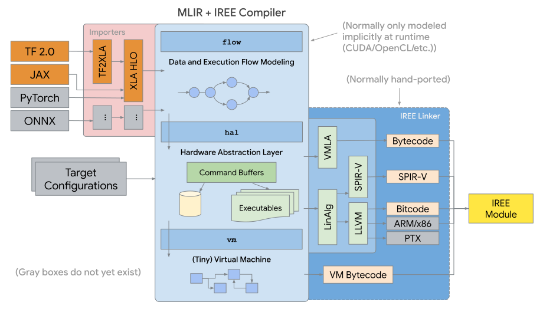

.. _sec-npu:

NPU compiler
============

.. contents::
   :local:
   :depth: 4

NPU compiler reference
----------------------

https://arxiv.org/pdf/2002.03794.pdf

Tensorflow support unknown shape [#tfunknownshape]_.
Though our npu support kernel call where kernel call is a set of 
commands to npu to deal shape at run time, it is unefficiency. 
As I remember mlit supports binding shape for unknown at compile-time
but not always work.
Lukily, we can customilze by redefining model to binding shape staticlly [20200412].  

Tensorflow
----------

The mechansim of Mlir and iree applied on tensorflow as the following figure is 
not fitted for off-line, stand alone without server-connection for tunning weight 
of face detection's purpose npu. It is designed for on-line server-connected npu.
The gpu of supporting spirv is best candidate until this date 2020/5/12.

.. _iree: 

Tensorflow rely on api without fixed format such as ONNX [#onnx-fmt]_. 
Eventually, I think it will hire onnx or come out its own real file format since
iree is a file format for spirv-gpu. 

llvm IR for NPU compiler
------------------------

.. _conv: 
.. figure:: ../Fig/npu/conv_onnx.png
  :align: center
  :scale: 100%

  Conv operation in onnx file

.. code-block:: llvm

  @weight = global [46 x 1 x 5 [5 x float]] [[[[5 x float] [float 0.05475775524973869, ...], [5 x float] [float ...]], ...]
  @conv = @llvm.npu1.conv float* @input, float* @weight, ...

Open source project
-------------------

https://github.com/google/iree

.. [#tfunknownshape] https://pgaleone.eu/tensorflow/2018/07/28/understanding-tensorflow-tensors-shape-static-dynamic/

.. [#onnx-fmt] Actually onnx format based on IO api with protobuffer. It has real binary format but may change from version to version. Tensorflow api has no real binary format.

